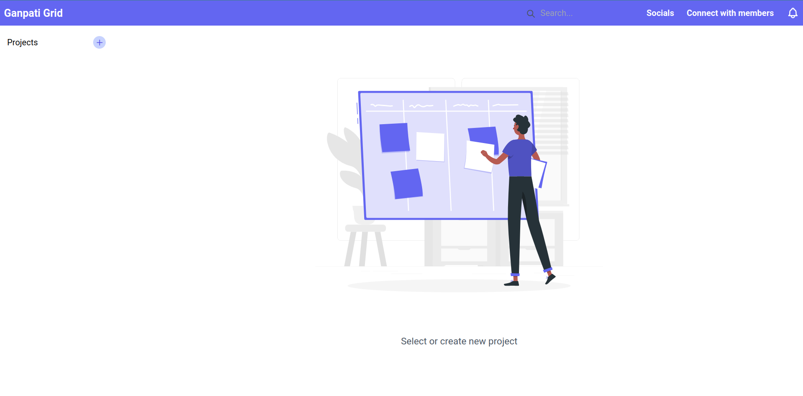

# Ganapati Grid (1.0.0)

## Table of Contents
- [Introduction](#introduction)
- [Features](#features)
- [Technologies](#technologies)
- [Installation](#installation)
- [Usage](#usage)
- [API Documentation](#api-documentation)
- [Configuration](#configuration)
- [Contributing](#contributing)
- [License](#license)

## Introduction
The Ganpati Grid Website is a web application designed to simplify project management and task assignment for software engineering teams. It offers a user-friendly platform for project creation, task tracking, and team collaboration, enhancing productivity and project transparency.

## Features
- **Project Management:** Create, edit, and manage projects with details and deadlines.
- **Task Assignment:** Assign tasks to team members and set task priorities.
- **Dashboard:** Visualize project progress and task statuses in a centralized dashboard.
- **Notifications:** Receive task and project updates through in-app notifications and email alerts.
- **Data Export:** Export project data for analysis and reporting.

## Technologies
- **Frontend:** [React](https://reactjs.org)
- **Backend:** [Node.js](https://nodejs.org) with [Express](https://expressjs.com)
- **Database:** [MongoDB](https://www.mongodb.com)
- **Real-Time Communication:** [Socket.io](https://socket.io)
- **User Interface (UI):** [Bootstrap](https://getbootstrap.com)

## Installation

- Step 1: install dependencies/node_module
  - Go to /backend directory for backend setup and run `npm install`

  - Go to /frontend directory for frontend setup and run `npm install`

- Step 2: Configure mongodb connection url
Go to backend directory and create .env file 
and put into `MONGODB_PATH=your-mongodb-connection-url`

- Step 3:  Change server port and cors origin (Optional)
by default your server running in port `http://localhost:9000` and cors origin/frontend url is`http://localhost:3000` , you can change port and cors, simply put this key into your .env
`SERVER_PORT=your-port` and` CORS_ORIGIN=-your-client-origin`

- Step 4: Run project
in your backend `npm run serve` for start node server and `npm run start` for frontend

## Packages used
- Tailwindcss
- Headlessui
- React router
- Axios
- UUID
- Joi
- Cors
- Dotenv

## Available Scripts

In the project directory, you can run:

### `npm start`

Runs the app in the development mode.\
Open [http://localhost:3000](http://localhost:3000) to view it in your browser.

The page will reload when you make changes.\
You may also see any lint errors in the console.

### `npm test`

Launches the test runner in the interactive watch mode.\
See the section about [running tests](https://facebook.github.io/create-react-app/docs/running-tests) for more information.

### `npm run build`

Builds the app for production to the `build` folder.\
It correctly bundles React in production mode and optimizes the build for the best performance.

The build is minified and the filenames include the hashes.\
Your app is ready to be deployed!

See the section about [deployment](https://facebook.github.io/create-react-app/docs/deployment) for more information.

### `npm run eject`

**Note: this is a one-way operation. Once you `eject`, you can't go back!**

## Contributing
Contributions are welcome! Please follow our Contribution Guidelines to submit issues, feature requests, or pull requests.

## License
This project is licensed under the MIT License.

---

**Mohit Sharma**
- [GitHub](https://github.com/Mohit-0918)
- [LinkedIn](www.linkedin.com/in/mohit-sharma0918)